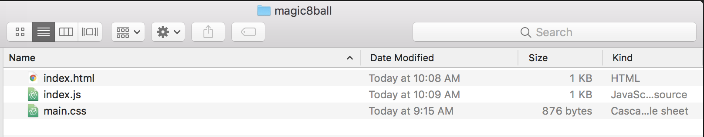

# :8ball: :rabbit: :tophat: magic8ball :tophat: :rabbit: :8ball:
A basic Javascript workshop that will walk through setting variables, conditionals, listening for events, and altering values. Join this one-hour workshop to learn how to learn how to build a magic 8 balls.

# Getting Started
#### :rabbit: Option 1 (easy peasy)
1. [Clone the repository](https://help.github.com/articles/cloning-a-repository/)
2. Open up `index.js` and start with step #1. Use the Word Bank below if you need help. Check your answers by navigating to the `index_solution.js` in this github repository.

#### :rabbit: Option 2 (if you don't have github setup)
1. Create a `magic8ball` folder on your Desktop
2. Navigate into `magic8ball` folder
3. Create three files:
    * `index.html`
    * `index.js`
    * `main.css`

    
4. In github, navigate to the `index.html` file and copy and paste the code into your newly created `index.html` file.
5. In github, navigate to the `main.css` file and copy and paste the code into your newly created `main.css` file.
6. In github, navigate to the `index.js` file and copy and paste the code into your newly created `index.js` file
7. Open up `index.js` and start with step #1. Use the Word Bank below if you need help. Check your answers by navigating to the `index_solution.js` in this github repository.

# Dictionary 
```javascript
console.log("Make more magic happen");
```
https://developer.mozilla.org/en-US/docs/Web/API/Console/log

```javascript
alert("Make the magic happen");
```
https://developer.mozilla.org/en-US/docs/Web/API/Window/alert

```javascript
document.getElementById("magicWord");
```
https://developer.mozilla.org/en-US/docs/Web/API/Document/getElementById

```javascript
magicButton.addEventListener("click", () => { insert_some_magic_here() });
```
https://developer.mozilla.org/en-US/docs/Web/API/EventTarget/addEventListener

```javascript
magicWordsFromInput.value;
```
https://developer.mozilla.org/en-US/docs/Web/API/HTMLInputElement

```javascript
magicWords.value.length;
```
https://developer.mozilla.org/en-US/docs/Web/JavaScript/Reference/Global_Objects/Array/length

```javascript
magicBallButton.innerText = "More magic";
```
https://developer.mozilla.org/en-US/docs/Web/API/Node/innerText

```javascript
Math.random();
```
https://developer.mozilla.org/en-US/docs/Web/JavaScript/Reference/Global_Objects/Math/random

# References
- https://glitch.com/~silver-keyboard
- https://developer.mozilla.org/en-US/
